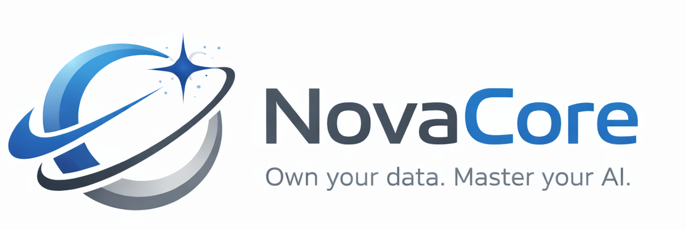

# NovaCore
**Own your data. Master your AI.**

NovaCore ist eine **Enterprise-fähige, souveräne KI-Plattform** für lokale Wissensverarbeitung, Retrieval Augmented Generation (RAG) und agentenbasierte Automatisierung.

NovaCore richtet sich an **Unternehmen, Behörden und anspruchsvolle Entwicklerteams**, die KI **kontrolliert, nachvollziehbar und datensouverän** einsetzen möchten – ohne Vendor-Lock-in und ohne unkontrollierten Datenabfluss.

---

## 🎯 Mission

- Volle Datenhoheit über Wissen & KI
- Strukturierte, reproduzierbare RAG-Pipelines
- Transparente & messbare KI-Ergebnisse
- Enterprise-Architektur statt Prototypen-Chaos

---

## 🏗️ Deployment & Betriebsmodelle

NovaCore ist eine **Web-Anwendung** und kann flexibel in unterschiedlichen Betriebsmodellen eingesetzt werden – je nach Sicherheitsanforderungen, Infrastruktur und Compliance-Vorgaben.

### Unterstützte Betriebsarten

- **Local / On-Premise**
  - Betrieb vollständig innerhalb der eigenen Infrastruktur
  - Keine externen Abhängigkeiten erforderlich
  - Ideal für sensible Daten, Behörden & regulierte Umgebungen

- **Private Cloud (Self-Hosted)**
  - Deployment in einer eigenen Cloud-Umgebung (z. B. Azure, AWS, GCP)
  - Volle Kontrolle über Daten, Netzwerke & Zugriffe
  - Geeignet für skalierbare Enterprise-Setups

- **Self-Managed Cloud**
  - Betrieb in gemanagten Kubernetes- oder VM-Umgebungen
  - Integration in bestehende CI/CD- und Security-Setups
  - Kombinierbar mit lokalen und externen LLM-Providern

Unabhängig vom Betriebsmodell bleibt NovaCore:
- **datensouverän**
- **vollständig kontrollierbar**
- **ohne Vendor-Lock-in**

> „Local“ bedeutet bei NovaCore **kontrolliert betrieben** – nicht „Desktop-Anwendung“.

---

## 📋 Features

### 🤖 Agent Chunker
Intelligenter Agent zur automatischen Wissenserschließung:

- Google-Suche basierend auf einer Fragestellung
- Automatischer Download & Parsing von Webseiten
- KI-gestützte Chunk-Erstellung
- Direkte Integration in die RAG-Pipeline
- Wiederverwendbare Chunk-Strategien:
  - Gesetzestexte
  - Markdown
  - strukturierte Dokumente

---

### 💬 RAG-basierter Chat
Konversationen mit **echtem, prüfbarem Kontext**:

- Antworten ausschließlich auf Basis eigener Dokumente
- Transparente Quellenangaben unter jeder Antwort
- Mehrere Chat-Profile je Use-Case
- **Performance Metrics**
  - Laufzeiten
  - Token-Nutzung
  - Retrieval-Qualität
  - Chunk-Trefferquote

---

### 📄 Dokumentenverarbeitung
Zentrale Wissensaufbereitung:

- Smart Document Chunking mit Pattern-Erkennung
- Import aus:
  - PDFs
  - HTML
  - Markdown
- **Notion-Plugin (bestehend)**
  - Direkter Import von Seiten & Datenbanken
- Collections zur logischen Trennung von Wissensräumen
- Grundlage für versioniertes & auditierbares RAG

---

### 🛠️ Konfiguration & Management
- Prompt-Editor für System- & Agent-Prompts
- Analyse & Vergleich von Prompt-Varianten
- LLM-Management:
  - mehrere Modelle
  - mehrere Provider
- Vollständig konfigurierbare RAG-Pipelines

---

### 📈 Analytics & Observability
- Laufzeit-Metriken
- Token- & Kostenanalyse
- Chunk-Verteilung & Qualitätsmetriken
- Grundlage für Monitoring, Audits & Governance

---

## 🤖 LLM- & Provider-Unterstützung

### Lokale Modelle
- **Ollama**
  - Mistral
  - Llama
  - Embedding-Modelle (z. B. `nomic-embed-text`)

### Cloud & API-basierte Modelle
- **Claude API** ✅
  - Hochwertige Analyse- & Reasoning-Fähigkeiten
  - Optional für hybride Szenarien
  - Vollständig in die Provider-Abstraktion integriert

---

## 🛠️ Technologie-Stack

### Backend & Architektur
- **.NET 10.0**
- **Entity Framework Core**
- **PostgreSQL**
- **Serilog**

### UI
- **Blazor Server**
- **Radzen Blazor Components**

### AI / RAG
- **Ollama**
- **Claude API**
- **Qdrant** (Vector Database)

### Parsing & Dokumente
- **PdfPig**
- **HtmlAgilityPack**

---

## 🏢 Enterprise-Readiness

NovaCore ist **von Grund auf Enterprise-ready konzipiert**.

### Warum .NET 10?
- Langfristige Stabilität & planbare Release-Zyklen
- Hervorragende Performance (Async, Parallelisierung, Memory-Effizienz)
- Starke Typisierung → wartbarer Code bei wachsender Komplexität
- Exzellente Observability & Debugging-Tools
- Bewährte Plattform für langlebige Unternehmenssoftware

### Warum Blazor Server?
- Zentrale Kontrolle über Geschäftslogik & Security
- Keine verteilte Business-Logik im Client
- Direkte Integration mit .NET-Services
- Ideal für interne Tools, Admin-Oberflächen & Fachanwendungen
- Sehr gut geeignet für:
  - Authentifizierung
  - Rollen & Berechtigungen
  - Audit-Logs

### Architekturprinzipien
- Saubere Trennung von UI, Services & Infrastruktur
- Erweiterbar über Provider- & Agent-Pattern
- Vorbereitet für:
  - Rollenbasierte Zugriffskontrolle (RBAC)
  - Multi-Tenant-Betrieb
  - Skalierbare Background-Agenten

---

## 🚀 Getting Started

### Voraussetzungen

1. .NET 10.0 SDK
2. Ollama (z. B. `mistral-small3.1`, `nomic-embed-text`)
3. Qdrant
4. PostgreSQL

---

### Installation

```bash
git clone <repository-url>
cd NovaCore/src
dotnet restore
dotnet run

## Setup SSL
- soon
```

## 🧭 Roadmap / Coming Soon

### 🤖 LLM- & Provider-Erweiterungen
- Erweiterte Unterstützung lokaler Ollama-Modelle
- **Mistral API (EU)**
- **OpenAI API**
- Einheitliche Reminder- & Failover-Strategien pro Provider
- Modell-Routing je Use-Case (Kosten, Latenz, Qualität)

---

### 📄 Dokumenten- & Wissens-Synchronisation

#### 🔄 Notion Plugin – Erweiterung
- Inkrementelle Synchronisation (Delta-Updates)
- Erkennung von Änderungen & Löschungen
- Metadaten- & Property-Mapping
- Versionierte RAG-Chunks
- Hintergrund-Synchronisation über Agenten

#### 📁 Massen-Dokumenten-Synchronisation
- Agent für Bulk-Import von:
  - PDFs
  - Text-Dateien
  - Word-Dokumenten
- Ordner- & Dateisystem-Watcher
- Automatische Re-Indexierung bei Änderungen

---

### 🔌 Wissens- & Business-Integrationen
- **Confluence Synchronisation**
  - Space-basierter Import
  - Seitenbaum als semantische Struktur
- **Jira Synchronisation**
  - Tickets, Kommentare & Beschreibungen
  - Projekt- & Label-basierte Wissensräume
- **HubSpot API**
  - CRM-Daten als kontextuelles Wissen für RAG

---

### 🔐 Authentifizierung & Sicherheit
- Allow-List-basierter lokaler Login
- **Microsoft Entra ID**
- **Keycloak (OIDC / SAML)**
- Rollen- & Berechtigungssystem (RBAC)
- Vorbereitung für Multi-Tenant-Betrieb

---

### 🧠 Agenten & Automatisierung
- Background-Agenten für zeitgesteuerte Jobs
- Event-basierte Re-Indexierung
- Konfigurierbare Pipelines:
  - Fetch → Parse → Chunk → Embed → Store
- Detaillierte Laufzeit- & Kostenmetriken pro Agent

---

### 📊 Governance & Enterprise Features
- Audit-Logs für Zugriffe & Antworten
- Nachvollziehbare Quellenketten
- Vorbereitung für Compliance- & Prüfanforderungen


## 🌍 Vision

NovaCore entwickelt sich zu einer **souveränen AI-Plattform**, die Organisationen in die Lage versetzt, ihre Daten **vollständig unter eigener Kontrolle** in echte, nutzbare Intelligenz zu verwandeln.

Die Vision von NovaCore ist eine Welt, in der:

- KI **lokal, nachvollziehbar und auditierbar** eingesetzt wird
- Wissen nicht in Silos verschwindet, sondern strukturiert erinnert wird
- RAG-Pipelines reproduzierbar, messbar und erklärbar sind
- Agenten zuverlässig Daten erschließen, statt Blackboxes zu erzeugen
- Unternehmen und Behörden **keine Kompromisse** zwischen Innovation und Datensouveränität eingehen müssen

NovaCore versteht sich nicht als Chatbot, sondern als **Intelligence Layer** über bestehenden Daten, Systemen und Dokumenten.

> **Own your data. Master your AI.**

## 📝 Lizenz

Dieses Projekt steht unter der **GNU Affero General Public License v3 (AGPL v3)**.

### Kurzfassung
- Die Nutzung, Änderung und Weiterverbreitung ist erlaubt
- Auch die **kommerzielle Nutzung** ist zulässig
- Bei Nutzung über ein Netzwerk (z. B. als Service) **muss der Quellcode offengelegt werden**
- Änderungen am Code müssen unter derselben Lizenz veröffentlicht werden

Die AGPL v3 stellt sicher, dass Verbesserungen an NovaCore der Community erhalten bleiben und schützt das Projekt vor proprietärer Vereinnahmung.

© Adrian Lorenz
